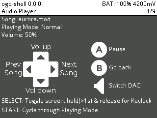

ogo-shell
=========

File browser and music player for the [odroid-go].

Screenshots
-----------

Features
--------

- Browse the sdcard
- Display Metadata/Details of files
- Audio Player
	- Supported Formats: MP3, OGG, WAV, FLAC, Modules(MOD,XM,IT,S3M)
	- Plays all audio files in a folder
	- Audio can be played through Speaker or external DAC

There are a lot more ideas for features and improvements.
You can find some of them in the [TODO.md](https://github.com/Paspartout/ogo-shell/blob/master/TODO.md) file.

Usage
-----

### Download

You should be able to download the latest fw file from [Githubs releases][releases].

### Controls for File Browser

- UP: Menu go up
- DOWN: Menu go down
- RIGHT: Jump page down
- LEFT: Jump page up
- A: Go into directory/Show file details/Play file
- B: Go up a directory
- MENU: Go back to firmware
- START: Display file details
- SELECT: Toggle file sizes(May make displaying slower)

### Controls for Music Player

- A: Play/Pause
- B: Close Song, Go back(Later: Continue playing in the background)
- VOLUME: Switch DAC/Speaker
- SELECT: Toggle display backlight for longer battery life?
- START: Toggle Playlist playing mode
- UP: Increase volume
- DOWN: Decrease volume
- RIGHT: Next Song
- LEFT: Previous Song

Building
--------

For building I used the [v3.2-odroid branch][esp-idf-fork] from [crashoverdrive] as a base.

In addition to that I patched the the sdcard functions of the idf to lock/unlock
a mutex. This mutex is used to synchronize access to the HSPI bus which is shared
by the sdcard and display on the odroid go. The patch is located in the patches folder.

So, to build the application you need to have the [esp-idf installed][esp-idf-setup].

To build the firmware you also need to have the [mkfw] utility installed.
Then simply run `make dist` to make the .fw file.
Take a look at the [Makefile](Makefile) to see how it works and if you want
to change the path to the mkfw utility.

Acknowledgements
----------------

I used the [hello-world-app] from [Jeff Kent] which uses his [hardware-lib]
to handle the odroids hardware. It made the development easier even though
I had to modify some functions to provide me with error context. Thanks!
Take a look at [LICENSE.template](LICENSE.template) for the license of his code.
I chose GPLv3 mainly to be more compatible with future libraries I want to use.

The audio playing libraries used are [stb_vorbis], [dr_mp3, dr_flac, dr_wav][drlibs] and [libxmp-lite].

[Jeff Kent]: https://github.com/jkent
[odroid-go]: https://wiki.odroid.com/odroid_go/odroid_go
[hello-world-app]: https://github.com/jkent/odroid-go-hello-world-app
[hardware-lib]: https://github.com/jkent/odroid-go-hardware-lib
[esp-idf-fork]: https://github.com/OtherCrashOverride/esp-idf/commits/release/v3.2-odroid 
[crashoverdrive]: https://github.com/OtherCrashOverride
[esp-idf-setup]: https://docs.espressif.com/projects/esp-idf/en/latest/get-started/index.html
[mkfw]: https://github.com/OtherCrashOverride/odroid-go-firmware/tree/master/tools/mkfw
[releases]: https://github.com/Paspartout/ogo-shell/releases
[stb_vorbis]: https://github.com/nothings/stb 
[drlibs]: https://github.com/mackron/dr_libs 
[libxmp-lite]: https://github.com/cmatsuoka/libxmp/tree/master/lite
